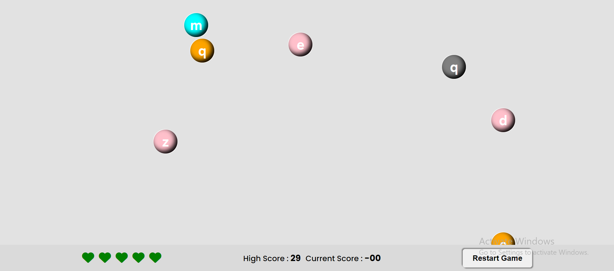

# **Bubble Typing Game**

## **Overview**

This is a bubble typing game by which a user can increase his typing speed by playing the game. It is an interactive and engaging game to push a person more to play and increase his typing speed.

## **Features**
1. Simple and easy to use user interface
2. Five life to play the game
3. Current and high score
4. Dynamic bubble speed and text to make game unpredictable

## **Technology Used**
1. HTML
2. CSS
3. JavaScript

## **Output**

## **Live Link**
